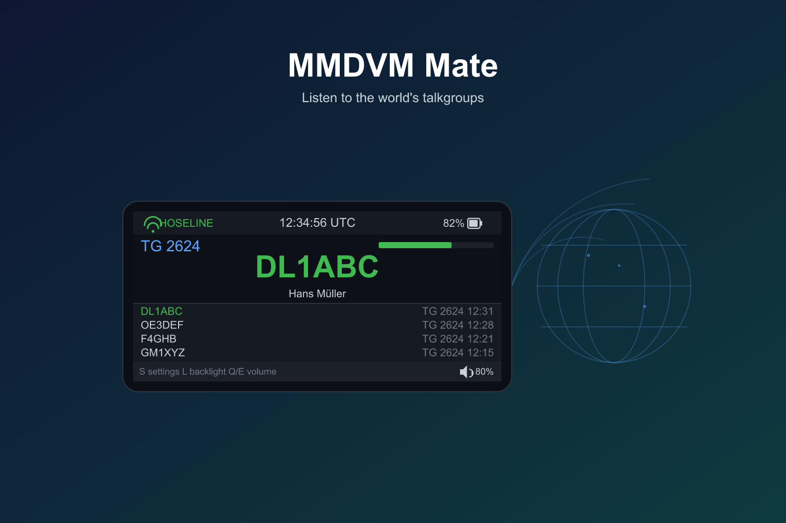
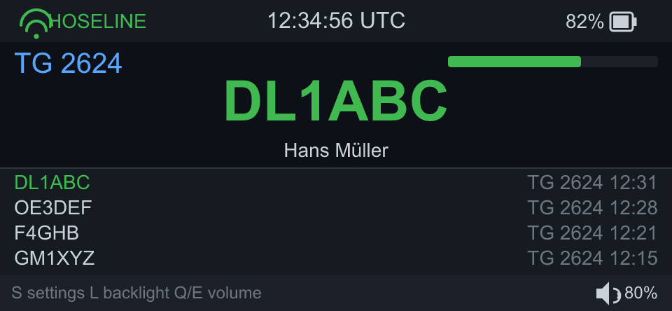

# MMDVM Mate

> **A pocket-sized live talkgroup listener for BrandMeister Hoseline.**

**Tune into global amateur-radio talkgroups wherever you have Wi-Fi.**

MMDVM Mate is a small, battery-powered companion that brings live digital-voice
talkgroup traffic to your pocket. Connect to Wi-Fi, pick a talkgroup, and listen to
operators around the world — while the screen shows you who is talking, a rolling QSO
history of recent contacts, and a live activity meter.

It is a **network listener**, not a transceiver: it only receives live audio from the
talkgroup feed and never transmits.

## How to play

1. On first boot, open **Settings** and enter your Wi-Fi name and password.
2. Choose the talkgroup you want to monitor. The orange key switches the keyboard to
   number mode, so you can type the talkgroup number directly.
3. The device reconnects automatically, subscribes to that talkgroup, and starts playing
   live audio.
4. Use the side keys for volume and backlight, and scroll the recent-contacts list with
   the rotary dial.

All settings are saved, so the next time you power on it just reconnects and keeps listening.

## Why it's fun

- **A window into a global community.** You might hear a repeater across town, or an
  operator on another continent.
- **Callsigns come alive.** Cryptic DMR IDs are resolved into real names and callsigns
  (via Talker Alias and radioid.net lookup).
- **Your personal "heard log."** The QSO history keeps the last contacts you monitored, so
  you can look back at who was on the air.
- **Truly standalone.** No phone, no PC, no companion app required — just Wi-Fi and
  curiosity.
- **Worry-free listening.** Because it only listens, you can monitor without the risk of
  accidentally keying up a transmitter.

## A note on listening

MMDVM Mate only monitors — it cannot transmit. Only tune in to talkgroups you are licensed
or authorised to receive in your area, and follow your local amateur-radio regulations.

---

### For builders

Source, build and flashing instructions live in [`docs/BUILD.md`](docs/BUILD.md).

## License

Released under the **MIT License** — see [`LICENSE`](LICENSE).

---

## 中文简介

MMDVM Mate 是一台小型、电池供电的随身装置，把数字语音通话组的实时通联装进你的口袋。
连接 Wi-Fi、输入一个通话组号码，就能收听世界各地的业余电台通联，同时屏幕会显示当前发话
的呼号、最近联络清单，以及实时活跃度表。它是一台**网络收听器**，不是收发信机：只接收
通话组语音流，从不发射。

**怎么玩：** 首次开机进入设定，输入 Wi-Fi 名称与密码；按橙色键把键盘切到数字模式，直接
输入想收听的通话组号码；装置自动重连、订阅并开始播放实时语音。所有设定都会保存，下次开机
即可自动继续收听。

**哪里有趣：** 通往全球业余电台社区的一扇窗；冷冰冰的 DMR ID 会被解析成真实姓名与呼号；
最近联络清单就是你的私人「收听日志」；完全独立，不需要手机、电脑或配套 App；因为只接收
不发话，不用担心误触发射。请只收听你所在地区获授权接收的通话组，并遵守当地法规。
